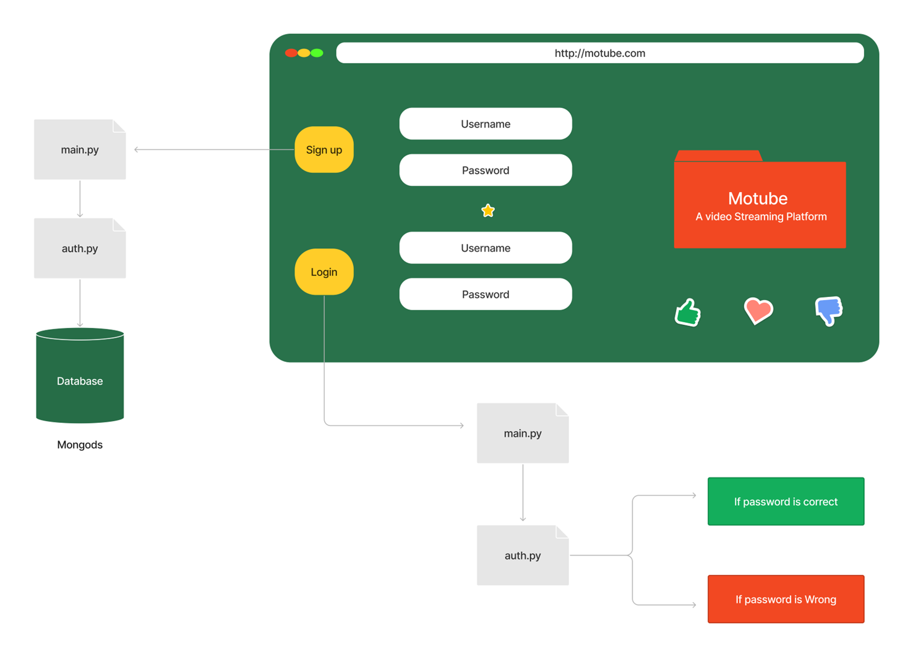
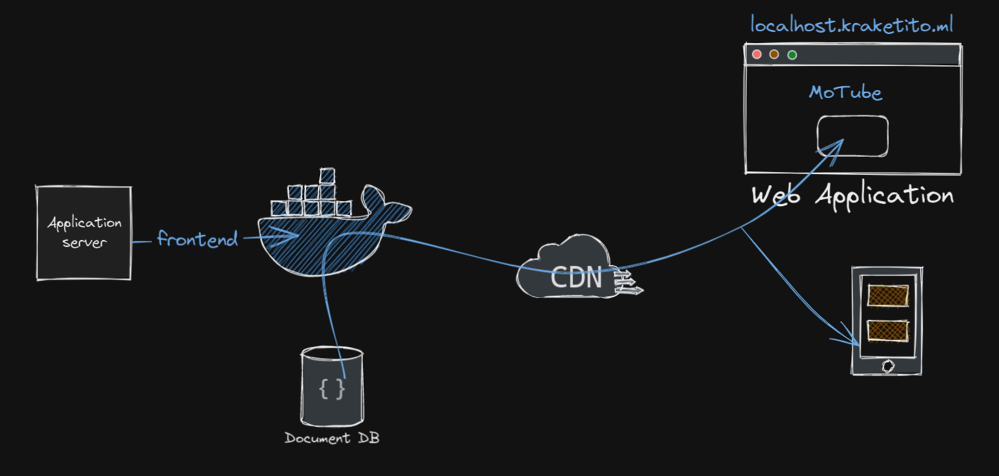

# Streamify-Mongo-App

# MongoStreamify

MongoStreamify is a video streaming platform that uses MongoDB as its database and is built using the FastAPI framework and Jinja2 templates. The platform allows users to upload, stream, and watch videos seamlessly, with fast loading times and smooth playback. The use of Docker for deployment ensures easy and efficient scaling of the platform.

## Features

- User authentication: Users can create an account and log in to access their videos and profile.
- Video uploading: Users can upload their videos to the platform and manage them from their profile.
- Video streaming: Videos can be streamed in high quality with fast loading times and smooth playback.
- Responsive design: The platform is designed to be responsive, adapting to different screen sizes and devices.
- Dockerized deployment: The platform can be easily deployed and scaled using Docker.

## Flow Diagram

Here is a flow diagram that shows the high-level architecture of the MongoStreamify platform:

### Deployment 

## Getting started

### Prerequisites

Before you can run MongoStreamify, you need to have the following installed on your machine:

- Python 3
- MongoDB

### Starting the MongoDB server

1. Open a terminal window and navigate to the MongoDB installation directory.
2. Run the following command to start the MongoDB server: `mongod`
3. Leave the terminal window open to keep the server running.

To run MongoStreamify on your local machine, follow these steps:

Start MongoDB Se

1. Clone the repository: `git clone https://github.com/EswarDivi/MongoStreamify.git`
2. Navigate to the project directory: `cd MongoStreamify`
3. Install the dependencies: `pip install -r requirements.txt`
4. Start the Authentication server: `uvicorn auth:app --reload --port 8000`
5. Start the Authentication server: `uvicorn main:app --reload --port 80`
6. Open your web browser and go to `http://localhost:80`

## Contributing

Contributions to MongoStreamify are welcome and encouraged! To contribute, follow these steps:

1. Fork the repository: click the "Fork" button on the repository page
2. Clone your forked repository: `git clone https://github.com/EswarDivi/MongoStreamify.git`
3. Create a new branch for your changes: `git checkout -b your-branch-name`
4. Make your changes and commit them: `git commit -m "your commit message"`
5. Push your changes to your forked repository: `git push origin your-branch-name`
6. Create a pull request: go to your forked repository page and click the "New pull request" button

## License

MongoStreamify is released under the [MIT License](https://opensource.org/licenses/MIT). 
See the LICENSE file for more details.

## Contact

If you have any questions or feedback about MongoStreamify, please contact us at [dabbaraharsha@gmail.com].

